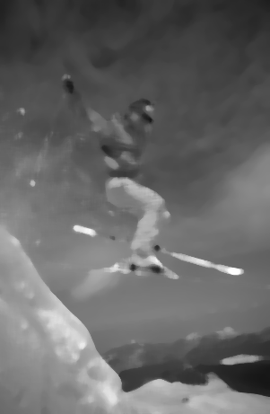
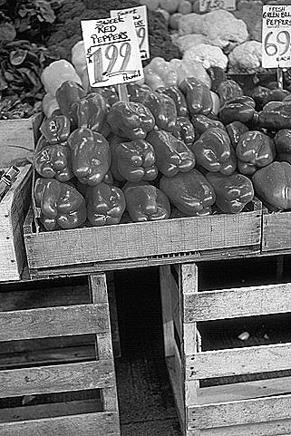

#PGMLib
PGMLib is a C Library for working with Pixel Gray Map Images (PGM files)

## Design Decisions
- Used PGM Format for kernel files as well, that way the user can load and apply custom kernels via pgm files
- Always allocate a new output pgm struct, this is so I can easily add layered filter support (think photoshop layers)
- Flexible PGM Parser, so that we can also load double based kernels or pgm files

## Examples

[Edges example] (example/edges.c)
usage: ./edges src.pgm out.pgm

</img> </img> 

[Median example] (example/median.c)
usage: ./median src.pgm out.pgm filterSize

</img> </img>

[Blur example] (example/blur.c)
usage: ./blur src.pgm out.pgm

</img> </img>

[Sharpen example] (example/sharpen.c)
usage: ./sharpen src.pgm out.pgm

</img> </img>

##Disclaimer
Published under the [MIT License](LICENSE).
